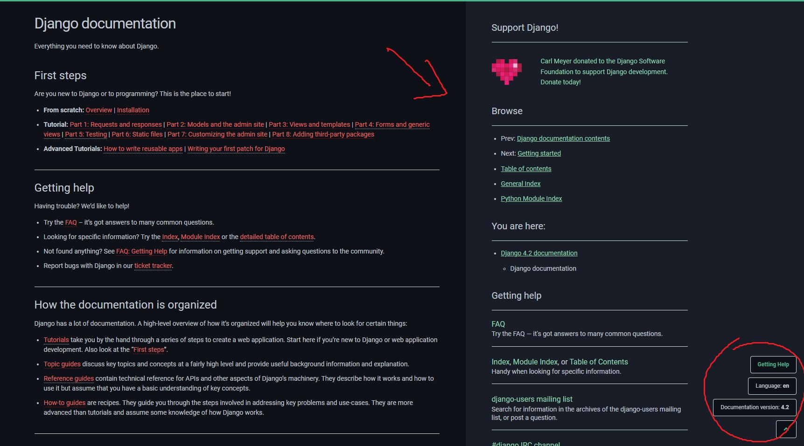
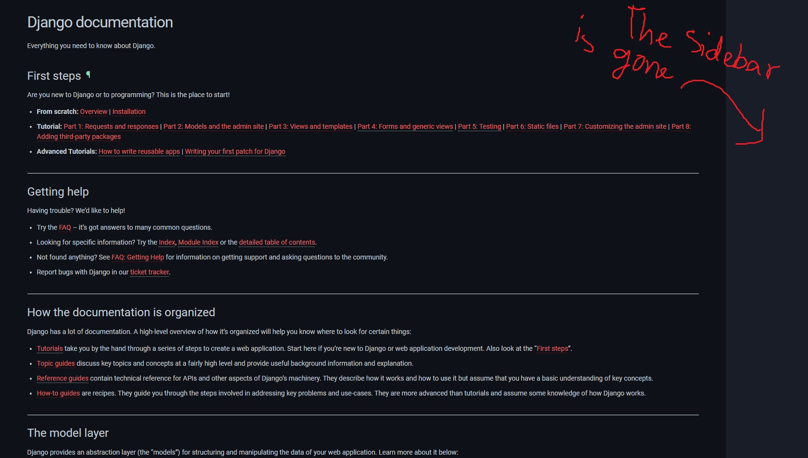

# Django-Sidebar

Is a chromium-based extension to disable the sidebar and side-menu in the official website of [Django](https://docs.djangoproject.com/en/4.2/)

## Puprose

I've found the sidebar and version-switcher and the right side of the official website of [Django](https://docs.djangoproject.com/en/4.2/), quite distracting. Thus I made this simple extension to be able to make it appear/disappear whenever I want to.

## Installation

The extension is available on the Brave and Google Chrom browsers.

## Usage
**Extension disabled:**

**Extension enabled:**

## Contributing

Pull requests are welcome.

## License

[Apache 2.0](https://github.com/behnoudng/django-sidebar/blob/main/LICENSE)

***
Twitter: [@behnoudng](https://www.twitter.com/behnoudng)
